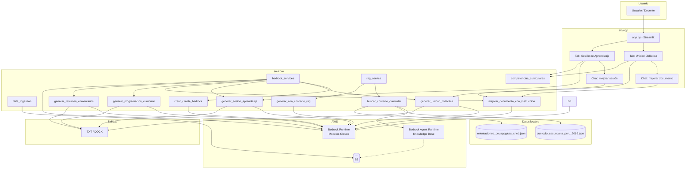
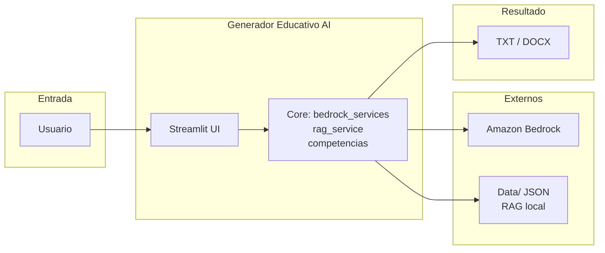

# Detalles técnicos del proyecto – Generador Educativo AI

Documento que describe la arquitectura técnica, conexión con AWS, RAG, técnicas de prompting y esquema del proyecto.

---

## 1. Conexión con AWS

### 1.1 Servicios utilizados

| Servicio | Uso en el proyecto |
|----------|---------------------|
| **Amazon Bedrock Runtime** | Invocación de modelos de lenguaje (Claude) para generación de texto. |
| **Amazon Bedrock Agent Runtime** | Recuperación desde Knowledge Bases cuando `BEDROCK_KB_CURRICULO_ID` está configurado. |
| **Amazon S3** | Carga de currículo y comentarios (opcional; usado por `data_ingestion` y por KB). |

### 1.2 Credenciales y configuración

- **Origen de credenciales** (en orden de prioridad):
  1. **Variables de entorno**  
     `AWS_ACCESS_KEY_ID`, `AWS_SECRET_ACCESS_KEY`, `AWS_REGION`. Opcional: `AWS_SESSION_TOKEN`, `AWS_PROFILE`.
  2. **Archivo `.env`**  
     Cargado con `python-dotenv` desde la raíz del proyecto (`pathlib` hacia `src/core/../../.env`). Solo se carga si el archivo existe.
  3. **Perfil AWS**  
     Si se define `AWS_PROFILE`, se usa `boto3.Session(profile_name=...)`.
  4. **Credenciales por defecto**  
     `~/.aws/credentials` o rol IAM (por ejemplo en EC2/Lambda).

- **Región por defecto:** `us-east-1` si no se define `AWS_REGION`.

- **Creación del cliente Bedrock:**  
  En `src/core/bedrock_services.py`, la función `crear_cliente_bedrock()` construye un cliente `bedrock-runtime` con `boto3.client(service_name='bedrock-runtime', region_name=...)`. Si se usan variables de entorno, se pasan explícitamente `aws_access_key_id` y `aws_secret_access_key` (y `aws_session_token` si existe).

### 1.3 Variables de entorno relevantes

```env
AWS_REGION=us-east-1
AWS_ACCESS_KEY_ID=...
AWS_SECRET_ACCESS_KEY=...
# Opcionales:
AWS_PROFILE=default
AWS_SESSION_TOKEN=...
BEDROCK_KB_CURRICULO_ID=...   # Si se usa RAG con Knowledge Base
```

### 1.4 Docker

- `docker-compose.yml` define el servicio `streamlit-app` con `env_file: .env` y reenvío de `AWS_REGION`, `AWS_ACCESS_KEY_ID`, `AWS_SECRET_ACCESS_KEY`, `AWS_SESSION_TOKEN`, `AWS_PROFILE`.
- La aplicación dentro del contenedor usa esas variables; no depende de un `.env` montado si se inyectan por `environment`.

### 1.5 Permisos IAM (referencia)

El archivo `bedrock-policy.json` incluye permisos de ejemplo para Bedrock Knowledge Base (crear KB, data source, iniciar ingestion) y `iam:PassRole` para el rol de la KB. Para invocar modelos y, si aplica, S3 y Bedrock Agent Runtime, la política en uso debe incluir:

- `bedrock:InvokeModel` (o `bedrock:InvokeModelWithResponseStream`) sobre los modelos utilizados.
- Si se usa Knowledge Base: permisos sobre `bedrock-agent-runtime` (por ejemplo `bedrock:Retrieve` según la API).
- Si se usa S3: `s3:PutObject`, `s3:GetObject` sobre los buckets correspondientes.

---

## 2. Esquema del proyecto

```
ia-gen-edu/
├── src/
│   ├── app/
│   │   └── app.py              # UI Streamlit (tabs: unidad didáctica y sesión de aprendizaje)
│   └── core/
│       ├── bedrock_services.py # Lógica principal: Bedrock, programación, unidades, sesiones, análisis de comentarios
│       ├── bedrock_summarization.py  # Resumen de comentarios (Claude v2)
│       ├── competencias_curriculares.py # 31 competencias CNEB, áreas, grados
│       ├── data_ingestion.py   # Subida a S3: comentarios y currículo
│       ├── rag_service.py      # RAG: KB o fallback local, búsqueda y generación con contexto
│       ├── database_management.py
│       ├── lambda_handler.py
│       └── sentiment_analysis.py
├── data/
│   ├── curriculo_secundaria_peru_2016.json   # Currículo en chunks para RAG local
│   ├── orientaciones_pedagogicas_cneb.json  # Orientaciones CNEB para RAG local
│   └── README.md
├── .env                        # Credenciales (no versionado; ver env.example)
├── env.example
├── docker-compose.yml
├── Dockerfile
├── bedrock-policy.json
├── run.py                      # Punto de entrada: streamlit run src/app/app.py
├── upload_curriculo.py         # Sube currículo JSON a S3 para KB
└── requirements.txt
```

- **Entrada de usuario:** `app.py` (Streamlit) → llamadas a `core` (bedrock_services, rag_service, competencias_curriculares, etc.).
- **Salida:** archivos TXT/DOCX en `~/Desktop/content_edu_outputs/` (o ruta configurada).

---

## 3. RAG (Retrieval Augmented Generation)

### 3.1 Flujo general

1. **Recuperación:** según configuración, se usa **Bedrock Knowledge Base** o **fallback local** (JSON en `data/`).
2. **Búsqueda:** con query enriquecida (grado, área, texto de búsqueda).
3. **Construcción de contexto:** se toman los documentos/chunks más relevantes y se concatenan en un bloque de “CONTEXTO OFICIAL”.
4. **Generación:** se invoca el modelo con un prompt que incluye rol, contexto oficial e instrucciones, pidiendo basarse solo en ese contexto.

### 3.2 Bedrock Knowledge Base (opcional)

- Si `BEDROCK_KB_CURRICULO_ID` está definido y no es el placeholder `KB-CURRICULO-ID-HERE`, `RAGEducativoService` usa:
  - Cliente `bedrock-agent-runtime`.
  - `retrieve(knowledgeBaseId=..., retrievalQuery={'text': query_enriquecida}, retrievalConfiguration={ 'vectorSearchConfiguration': { 'numberOfResults': 10, 'overrideSearchType': 'HYBRID' } })`.
- Los documentos se esperan en S3; el currículo se puede subir con `upload_curriculo.py` al bucket configurado (por defecto `minedu-educacion-peru` con prefijo `curriculo/`).

### 3.3 Fallback RAG local

- **Fuentes:**  
  - `data/curriculo_secundaria_peru_2016.json`  
  - `data/orientaciones_pedagogicas_cneb.json`

- **Estructura de cada JSON:**
  - `metadata`: documento, país, año, etc.
  - `keywords`: lista global de palabras clave.
  - `chunks`: lista de fragmentos con `id`, `section`, `text`, `keywords`.

- **Búsqueda local** (`_buscar_contexto_local` en `rag_service.py`):
  - Se añaden a la query tokens de grado y área.
  - Por cada chunk se calcula un score con:
    - Coincidencias con `keywords` del chunk y con la query.
    - Coincidencias de tokens de la query en `text` y `section`.
    - Coincidencias con `keywords` globales del documento.
  - Se ordenan por score y se devuelven hasta `top_k` (8 para currículo, 6 para orientaciones; luego se unifican y se toman hasta 10).

- **Construcción del contexto:**  
  `_construir_contexto_educativo` toma hasta 5 documentos y forma un texto con número de documento, fuente, relevancia (score) y contenido.

### 3.4 Generación con RAG

- Método `generar_con_contexto_rag(prompt, contexto_documentos)`:
  - Prompt tipo: *“Eres un experto en educación peruana… CONTEXTO OFICIAL DEL MINEDU: {contexto_rag} INSTRUCCIONES: {prompt} Basa tu respuesta EXCLUSIVAMENTE en el contexto oficial…”*.
  - Modelo usado en RAG: `anthropic.claude-v2:1` (formato `prompt`/`completion`), `temperature=0.3`, `max_tokens_to_sample=2000`.

- Función de alto nivel `generar_programacion_curricular_rag(grado, competencia, capacidades, contenidos)`:
  - Arma una query de búsqueda con grado, área, competencia y contenidos.
  - Llama a `buscar_contexto_curricular` y luego a `generar_con_contexto_rag` con un prompt de programación curricular.
  - Añade al final un bloque “FUENTES OFICIALES CONSULTADAS”.

---

## 4. Técnicas de prompting

### 4.1 Programación curricular (`generar_programacion_curricular`)

- **Rol:** “Actúa como especialista en programación curricular”.
- **Restricción de formato:** “CRÍTICO: Debes generar SOLO tablas… TODO el contenido debe estar DENTRO de las celdas… NO generes nada fuera de la estructura de tabla.”
- **Datos estructurados:** bloque INFORMACIÓN BASE con GRADO, COMPETENCIA, CAPACIDADES, CONTENIDOS.
- **Instrucciones numeradas:** transcribir competencia/capacidades, organizar contenidos, generar desempeños (12–15), criterios (2–3 por desempeño), instrumentos variados, tabla principal de 6 columnas, secciones adicionales (competencias transversales, enfoques, secuencia de 6 sesiones).
- **Formato explícito:** ejemplos de tabla en markdown (`| COMPETENCIA | CAPACIDADES | ... |`, `| ITEM | CONTENIDO |`) y reglas (no HTML, no viñetas, solo texto plano en celdas).
- **Documento de referencia opcional:** si el usuario sube un DOCX, su contenido (recortado a 3000 caracteres) se inyecta en un bloque “DOCUMENTO DE REFERENCIA” para adaptar la programación.
- **Auto-crítica iterativa:** tras la primera generación se hacen hasta `num_iteraciones` (por defecto 3) llamadas de “mejora” con criterios rotativos (especificidad de desempeños, coherencia contenidos–desempeños–criterios, instrumentos de evaluación). Cada prompt de mejora incluye la programación anterior y pide mantener el mismo formato de tablas.

### 4.2 RAG (programación con contexto oficial)

- **Rol:** “Eres un experto en educación peruana especializado en el Currículo Nacional de Educación Básica.”
- **Estructura:** CONTEXTO OFICIAL DEL MINEDU (documentos recuperados) + INSTRUCCIONES (prompt de tarea).
- **Restricción:** “Basa tu respuesta EXCLUSIVAMENTE en el contexto oficial… Si no encuentras información suficiente, menciona qué información faltaría.”
- **Tono:** “Estructura tu respuesta de manera profesional y alineada con los documentos oficiales del MINEDU.”

### 4.3 Análisis de comentarios

- **En `bedrock_services.generar_resumen_comentarios`:**  
  Rol “especialista de educación, experto en calidad educativa”; bloque “— Comentarios —” y “Resumen:”. Formato de mensajes Claude 3.
- **En `bedrock_summarization.generate_summary_bedrock`:**  
  Rol “analista de mercado experto”; mismo esquema Comentarios / Resumen. Uso de API legacy (prompt/completion).

### 4.4 Mejora de documento (`mejorar_documento_con_instruccion`)

- **Rol:** “Eres un editor experto en documentos educativos del MINEDU Perú.”
- **Documento:** contenido entre triple comillas.
- **Instrucciones:** bloque “INSTRUCCIONES DEL USUARIO” y “TAREA” (aplicar lo pedido, conservar estructura y formato de tablas, no añadir explicaciones, devolver solo el documento modificado).
- **Temperature:** 0.4 para cambios controlados.

### 4.5 Unidad didáctica y sesión de aprendizaje

- Prompts largos con área, grado, competencia de referencia, y formato de tabla `| ITEM | CONTENIDO |` para secciones (similar a programación). Se pide coherencia con el currículo y estructura de unidad/sesión.

---

## 5. Modelos de Bedrock utilizados

| Modelo | Uso |
|--------|-----|
| `anthropic.claude-3-sonnet-20240229-v1:0` | Programación curricular (inicial + iteraciones), unidad didáctica, sesión de aprendizaje, resumen de comentarios en app, mejora de documento. |
| `anthropic.claude-v2` | Resumen de comentarios en `bedrock_summarization.generate_summary_bedrock` (API legacy). |
| `anthropic.claude-v2:1` | Generación con RAG en `rag_service.generar_con_contexto_rag`. |

- **Claude 3:** cuerpo con `anthropic_version: bedrock-2023-05-31`, `messages` (role `user`, `content`), `max_tokens`, `temperature`, `top_p`. Respuesta en `response_body['content'][0]['text']`.
- **Claude v2 (legacy):** cuerpo con `prompt`, `max_tokens_to_sample`, `temperature`, `top_p`. Respuesta en `response_body['completion']`.

---

## 6. Ingesta de datos y S3

- **`data_ingestion.upload_curriculo_to_s3`:**  
  Sube `data/curriculo_secundaria_peru_2016.json` al bucket (por defecto `minedu-educacion-peru`) bajo la clave `curriculo/curriculo_secundaria_peru_2016.json`, para que una Bedrock Knowledge Base pueda ingerirlo.

- **`data_ingestion.upload_comments_to_s3`:**  
  Escribe un JSON de comentarios en `s3://{bucket}/comments/comments_{timestamp}.json` (útil para flujos tipo Lambda o procesamiento asíncrono).

- **Cliente S3:**  
  `boto3.client('s3', region_name=os.environ['AWS_REGION'])`; la región suele tomarse de `AWS_REGION` (por defecto `us-east-1`).

---

## 7. Resumen de flujos principales

1. **Programación curricular (sin RAG):**  
   Formulario → `generar_programacion_curricular()` → prompt inicial + hasta 3 iteraciones de mejora → postprocesado (limpieza HTML, validación de tablas) → TXT/DOCX.

2. **Programación curricular (con RAG):**  
   Formulario → `generar_programacion_curricular_rag()` → `buscar_contexto_curricular()` (KB o local) → `generar_con_contexto_rag()` → resultado + fuentes consultadas.

3. **Análisis de comentarios:**  
   Lista de comentarios → `generar_resumen_comentarios()` (o `generate_summary_bedrock`) → resumen → TXT/DOCX.

4. **Unidad / sesión:**  
   Parámetros (área, grado, competencia) → `generar_unidad_didactica()` o `generar_sesion_aprendizaje()` → contenido en formato tabla → exportación.

---

## 8. Diagrama de flujo del proyecto (Mermaid)



**Versión simplificada (flujo de alto nivel):**



---

*Última actualización: febrero 2026*
